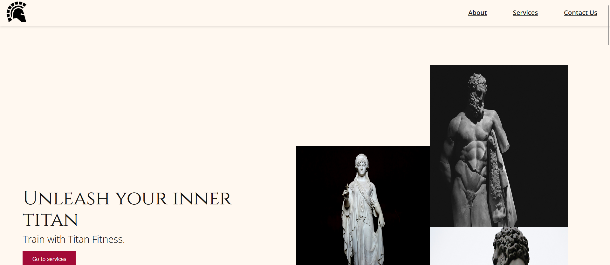
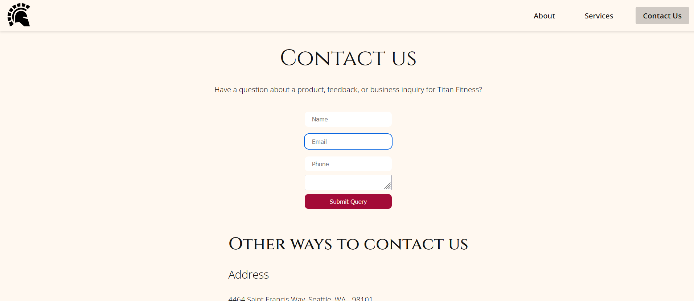

# Titan Fitness

## What is it?
A mock-up page for a fitness website, Titan Fitness. Made using SCSS, React, FakerJS, JSON, Framer Motion. Hosted on Vercel.

**Link to the website**: https://titan-gym-fitness.vercel.app/

### Built with

- React
- SCSS
- Framer Motion
- React Spring
- Figma
- Vite

#### Process

- Website is mainly built using Vite + React setup.
- SCSS is used for styling.
- Framer Motion + React Spring give us some noiiiiice animations.
- Vercel lets you host for free.

### Screenshots





## Getting Started

Here's how you can setup this page locally.

1. Clone the repo

```bash
git clone https://github.com/aigle-levant/titan-gym-fitness.git
```

2. Install the required npm packages [not many, I swear].

```git
npm install
```

3. Change git remote url to avoid accidental pushes to base project

```bash
git remote set-url origin aigle-levant/titan-gym-fitness
   git remote -v
```

## Roadmap

- [ ] Add info. for services page
- [ ] Add dark mode

## Contact

Any queries? Go for the following links.

Twitter [now known as X] - [@aiglelevant](https://x.com/aiglelevant)
LinkedIn - [Prajanya Subramanian](https://www.linkedin.com/in/prajanya-subramanian/)
GitHub [you're here!] - [@aigle-levant](https://github.com/aigle-levant)
Email - [aiglelevant@gmail.com](mailto:aiglelevant@gmail.com)
